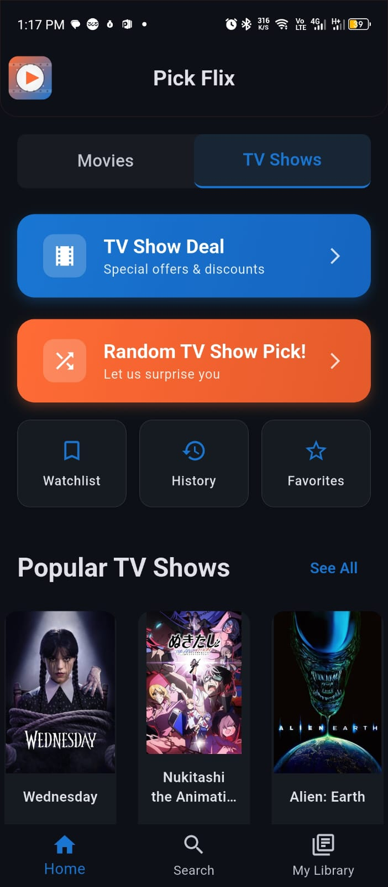
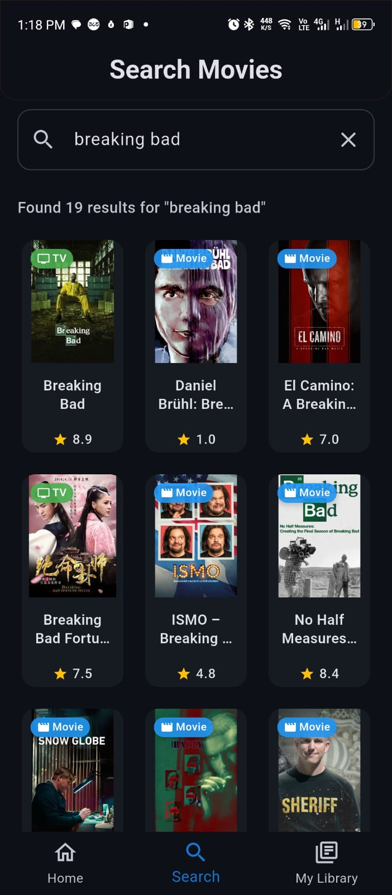
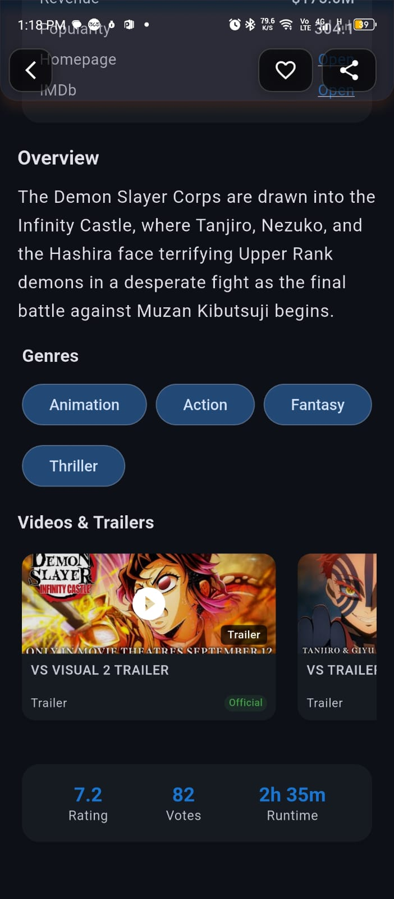
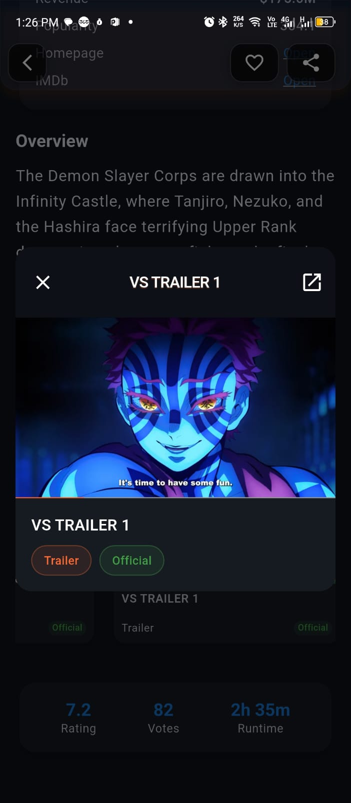

# 🎬 PickFlix

<div align="center">

**Your Ultimate Movie & TV Show Discovery Companion**


---

*Discover, explore, and organize your favorite movies and TV shows with PickFlix - a beautifully crafted Flutter application powered by The Movie Database (TMDB) API.*

[📱 Download APK](#download) • [🚀 Features](#features) • [📸 Screenshots](#screenshots) • [🛠 Tech Stack](#tech-stack)

---

</div>

## 📱 Download

> **Coming Soon!** Download links will be available here once the app is published.

<div align="center">

| Platform | Status | Link |
|----------|--------|------|
| 🤖 **Android APK** | `Coming Soon` | [Download APK](#) |
| 🍎 **iOS App Store** | `Planned` | [App Store](#) |
| 🔗 **Web Version** | `Planned` | [Launch Web App](#) |

</div>

---

## 🚀 Features

### 🎭 **Content Discovery**
- 📺 **Browse Categories**: Popular, Top Rated, and Upcoming movies & TV shows
- 🎯 **Genre-Based Recommendations**: Select your favorite genres for personalized suggestions
- 🔍 **Universal Search**: Find movies, TV shows, and people across the TMDB database

### 💫 **Personal Library**
- ❤️ **Favorites**: Save your beloved movies and TV shows
- 🕒 **Watch History**: Keep track of what you've watched
- 📌 **Watchlist**: Never forget what you want to watch next

### ⚡ **Technical Excellence**
- 🏗️ **Clean Architecture**: Scalable and maintainable codebase
- 🎯 **BLoC Pattern**: Robust state management for smooth user experience
- 🎨 **Modern UI**: Intuitive and responsive design
- 🚀 **Performance**: Optimized for speed and efficiency

---

## 📸 Screenshots

<div align="center">

### 🎬 Movie & TV Discovery
 

### 🔍 Search & Details
 

### 🎥 Media Experience


</div>

---

## 🛠 Tech Stack

<div align="center">

| Category | Technology | Purpose |
|----------|------------|---------|
| **Framework** |  | Cross-platform mobile development |
| **Language** |  | Primary programming language |
| **State Management** |  | Predictable state management |
| **Architecture** | Clean Architecture | Scalable and testable code structure |
| **API** |  | Movie and TV show data |

</div>

---

## 🏗 Architecture

PickFlix follows **Clean Architecture** principles for maintainable and scalable code:

```
📁 lib/
├── 🎯 core/           # Shared utilities and constants
├── 📊 data/           # Data sources and repositories
├── 🏢 domain/         # Business logic and entities
├── 🎨 presentation/   # UI components and BLoC
└── 🔧 injection/     # Dependency injection
```

---

## 🎯 About This Project

PickFlix was crafted as a **learning project** to master modern Flutter development practices:

- ✅ **Clean Code Principles**
- ✅ **Modular Architecture**
- ✅ **Advanced State Management**
- ✅ **API Integration**
- ✅ **Modern UI/UX Design**

---

## 🚀 Getting Started

### Prerequisites
- Flutter SDK (>= 3.0.0)
- Dart SDK (>= 3.0.0)
- TMDB API Key

### Installation

1. **Clone the repository**
   ```bash
   git clone https://github.com/yourusername/pickflix.git
   cd pickflix
   ```

2. **Install dependencies**
   ```bash
   flutter pub get
   ```

3. **Add your TMDB API key**
   ```bash
   # Create a .env file and add your API key
   TMDB_API_KEY=your_api_key_here
   ```

4. **Run the app**
   ```bash
   flutter run
   ```

---

## 🤝 Contributing

Contributions are welcome! Please feel free to submit a Pull Request. For major changes, please open an issue first to discuss what you would like to change.

---

## 📄 License

This project is licensed under the MIT License - see the [LICENSE](LICENSE) file for details.

---

## 🙏 Acknowledgments

- **TMDB** for providing the comprehensive movie and TV database
- **Flutter Team** for the amazing framework
- **BLoC Library** maintainers for excellent state management

---

<div align="center">

**Made with ❤️ using Flutter**

*Don't forget to ⭐ this repo if you found it helpful!*

[⬆ Back to Top](#-pickflix)

</div>